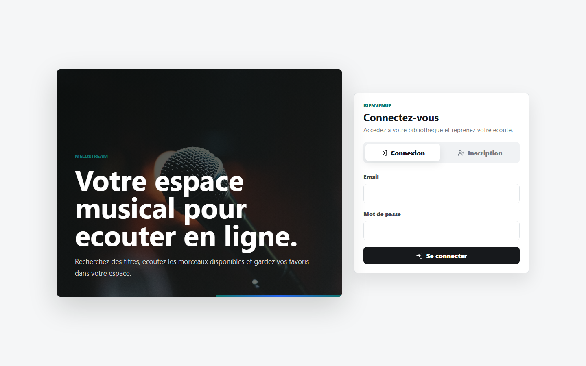
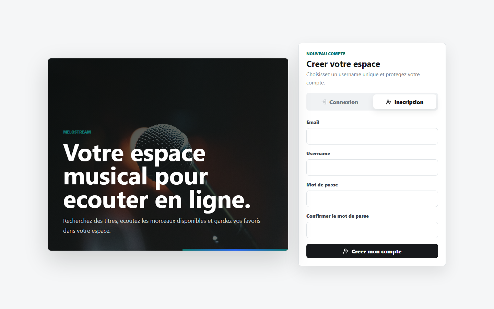
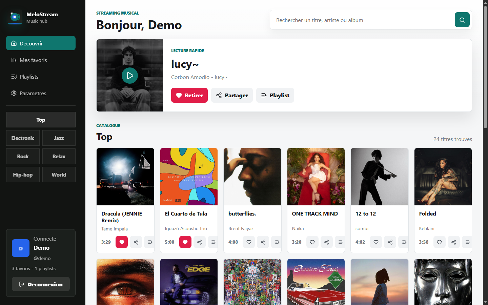
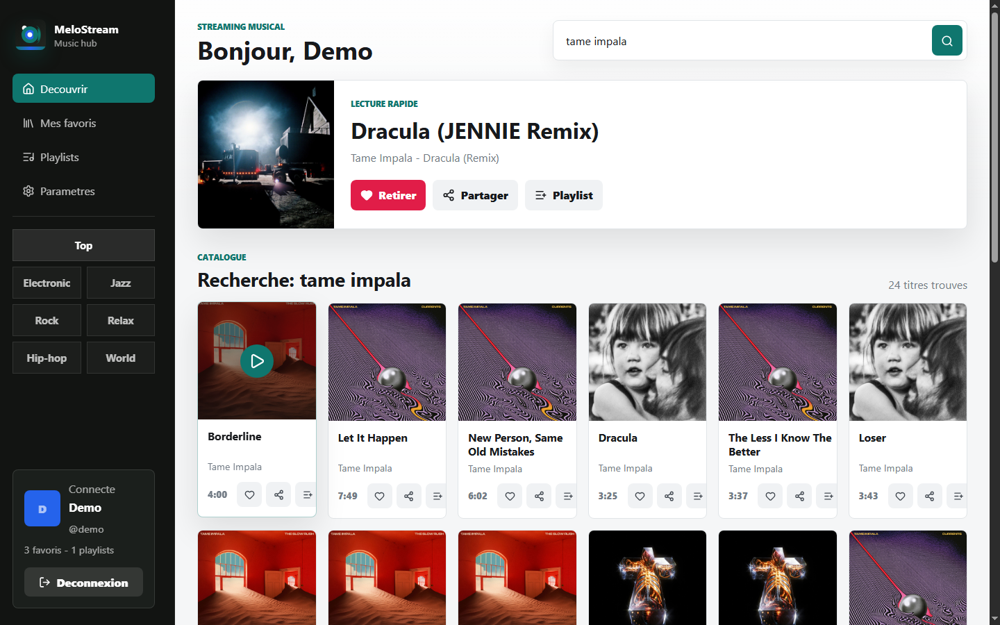
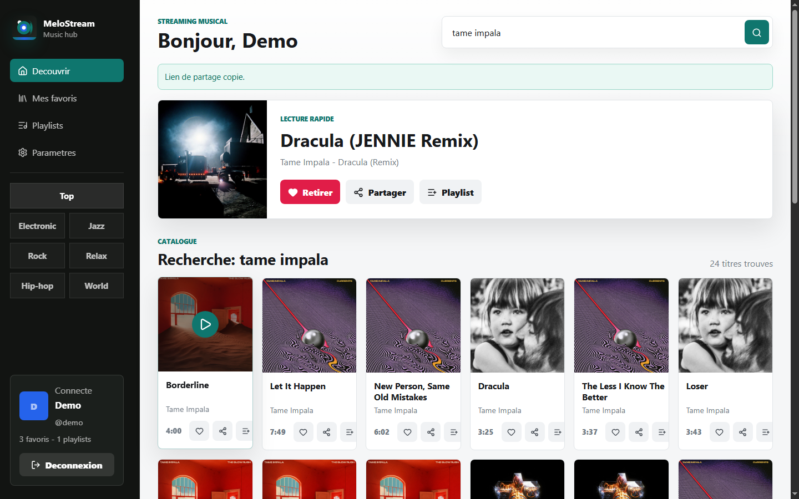
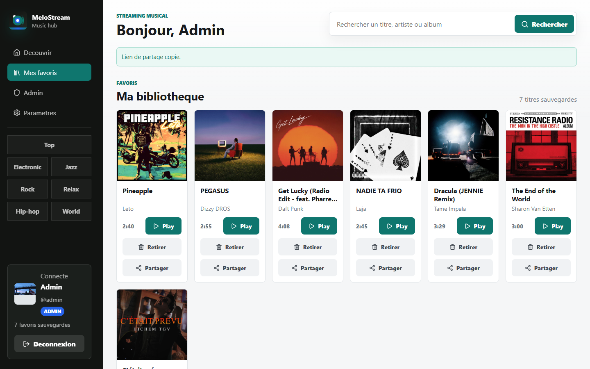
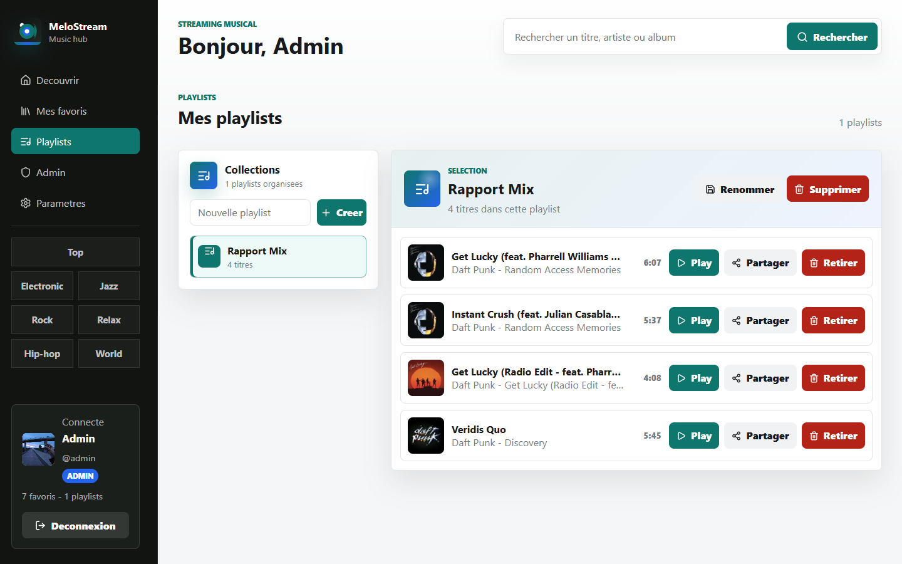
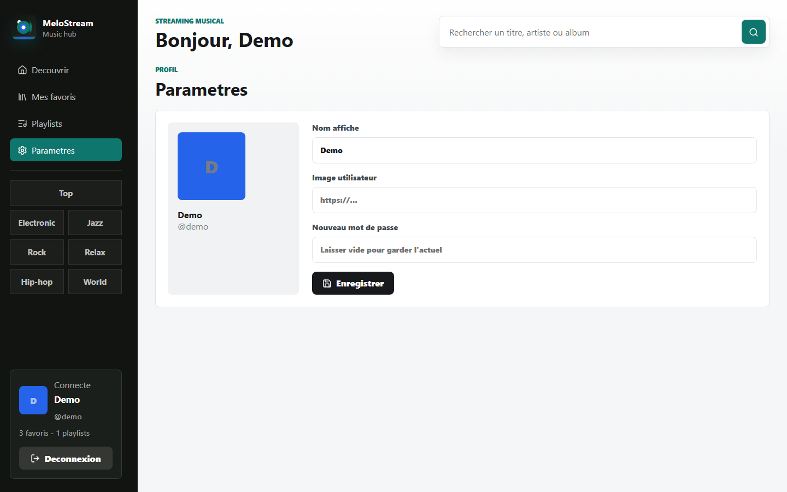
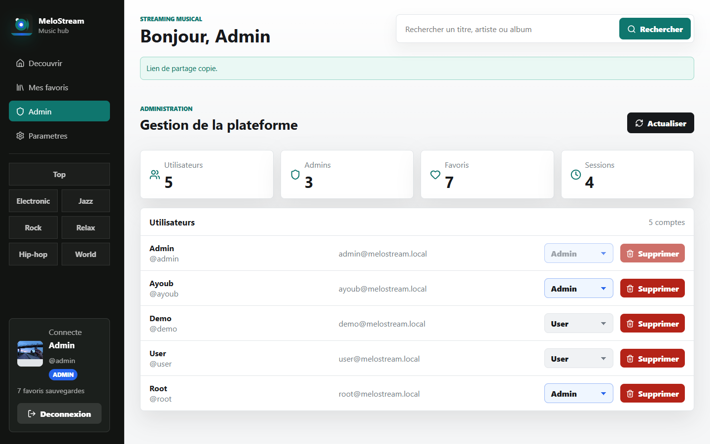
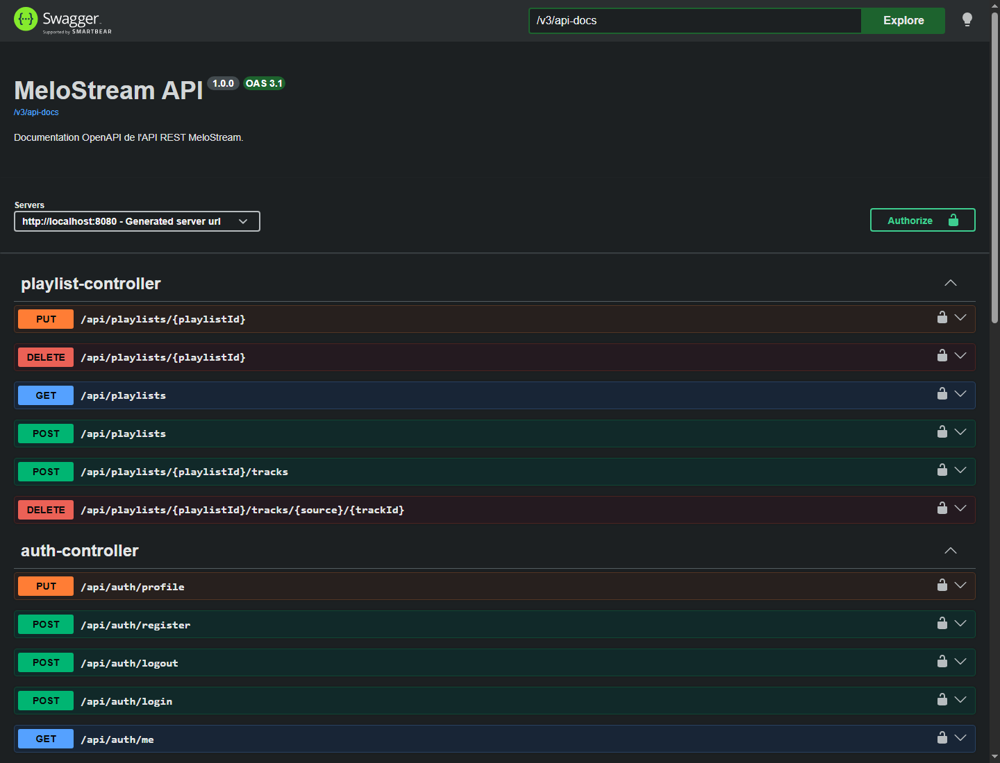

# MeloStream

MeloStream est une application web de streaming musical developpee avec un
backend Spring Boot et un frontend Angular. Elle permet de rechercher des
morceaux, ecouter des extraits ou des titres disponibles, gerer des favoris,
organiser des playlists, administrer les utilisateurs et partager un titre avec
un lien direct.

Ce fichier sert de documentation principale du projet. Le rapport LaTeX est
disponible dans `rapport/rapport.tex`, avec une version PDF generee dans
`rapport/rapport.pdf`.

## 1. Introduction

### 1.1 Contexte

Les plateformes musicales sont devenues des outils essentiels pour rechercher,
ecouter et organiser de la musique. Le projet MeloStream propose une version
pedagogique d'une plateforme de streaming musical, avec une interface web
moderne, une API securisee et une persistance des donnees utilisateur.

L'application s'appuie sur des API musicales externes pour recuperer les
titres, les artistes, les albums, les pochettes et les sources audio. Deezer est
utilise par defaut pour les extraits audio. Jamendo peut etre active pour les
morceaux libres/licencies avec un `client_id`.

### 1.2 Objectifs

- Developper une application web complete frontend/backend.
- Permettre a un utilisateur de creer un compte, se connecter et gerer son
  profil.
- Afficher un catalogue musical consultable par recherche ou humeur.
- Permettre l'ecoute d'un titre sans lecture automatique apres connexion.
- Ajouter, supprimer et consulter les titres favoris.
- Creer des playlists et y organiser des chansons.
- Partager un titre avec un lien accessible par un autre utilisateur.
- Fournir une interface d'administration protegee par role.
- Documenter le projet dans un seul fichier README clair et maintenable.

## 2. Cahier des charges

### 2.1 Problematique

L'objectif est de concevoir une plateforme musicale simple, ergonomique et
securisee, capable de connecter une interface Angular avec une API Spring Boot
et une base de donnees MySQL. Le systeme doit aussi communiquer avec des API
externes tout en gardant une structure propre et evolutive.

### 2.2 Besoins fonctionnels

| Reference | Besoin |
| --- | --- |
| BF01 | Creer un compte utilisateur. |
| BF02 | Se connecter et se deconnecter. |
| BF03 | Consulter le profil connecte. |
| BF04 | Modifier le nom, l'email, le nom d'affichage et l'avatar. |
| BF05 | Rechercher des titres par mot-cle ou par humeur. |
| BF06 | Ecouter un titre depuis le lecteur integre. |
| BF07 | Sauvegarder un titre dans les favoris. |
| BF08 | Supprimer un titre des favoris. |
| BF09 | Creer, renommer et supprimer une playlist. |
| BF10 | Ajouter ou retirer des titres d'une playlist. |
| BF11 | Partager un titre avec un lien direct. |
| BF12 | Ouvrir un lien de partage et charger le titre correspondant. |
| BF13 | Consulter les statistiques administrateur. |
| BF14 | Lister, promouvoir, retrograder et supprimer des utilisateurs. |

### 2.3 Besoins non fonctionnels

| Reference | Besoin |
| --- | --- |
| BNF01 | Interface responsive pour desktop et mobile. |
| BNF02 | API REST securisee par jeton d'authentification. |
| BNF03 | Mots de passe stockes sous forme de hash. |
| BNF04 | Separation claire entre controllers, services, repositories, DTO et mappers. |
| BNF05 | Base MySQL creee automatiquement si elle n'existe pas. |
| BNF06 | Code testable avec tests frontend et backend. |
| BNF07 | Couleurs simples, lisibles et coherentes. |

### 2.4 Solution proposee

La solution est composee de deux applications:

- `backend`: API Spring Boot responsable de l'authentification, des favoris,
  de l'administration et de l'integration musicale.
- `frontend`: application Angular responsable de l'interface utilisateur, du
  lecteur audio, du partage de titres et de l'experience visuelle.

La base MySQL conserve les utilisateurs, les jetons actifs et les favoris. Les
titres musicaux viennent principalement de Deezer ou Jamendo.

## 3. Conception fonctionnelle

### 3.1 Acteurs

| Acteur | Description |
| --- | --- |
| Visiteur | Peut creer un compte ou se connecter. |
| Utilisateur | Peut rechercher, ecouter, sauvegarder, organiser et partager des titres. |
| Administrateur | Peut gerer les utilisateurs et consulter les statistiques. |
| API musicale externe | Fournit les titres, pochettes, artistes et audios. |

### 3.2 Cas d'utilisation

| Acteur | Cas d'utilisation |
| --- | --- |
| Visiteur | Inscription, connexion. |
| Utilisateur | Recherche musicale, lecture, favoris, playlists, partage, modification du profil. |
| Administrateur | Consultation des statistiques, gestion des utilisateurs et roles. |
| API externe | Recherche de titres, recuperation d'un titre par source et identifiant. |

Diagramme simplifie:

```text
Visiteur
  -> S'inscrire
  -> Se connecter

Utilisateur
  -> Rechercher un titre
  -> Ecouter un titre
  -> Ajouter aux favoris
  -> Retirer des favoris
  -> Gerer ses playlists
  -> Partager un titre
  -> Modifier le profil

Administrateur
  -> Voir les statistiques
  -> Gerer les utilisateurs
  -> Modifier les roles
```

### 3.3 Modele de domaine

| Classe | Role | Champs principaux |
| --- | --- | --- |
| `UserAccount` | Utilisateur de l'application. | `id`, `username`, `email`, `displayName`, `passwordHash`, `role`, `avatarUrl`, `createdAt` |
| `AuthToken` | Jeton de session stateless. | `id`, `token`, `user`, `createdAt`, `expiresAt` |
| `FavoriteTrack` | Titre sauvegarde par un utilisateur. | `id`, `user`, `trackId`, `title`, `artist`, `album`, `imageUrl`, `audioUrl`, `duration`, `shareUrl` |
| `Playlist` | Liste musicale creee par un utilisateur. | `id`, `user`, `name`, `createdAt`, `updatedAt` |
| `PlaylistTrack` | Titre stocke dans une playlist. | `id`, `playlist`, `source`, `trackId`, `title`, `artist`, `album`, `audioUrl`, `shareUrl` |
| `TrackDto` | Titre retourne par l'API musicale. | `id`, `source`, `title`, `artist`, `album`, `imageUrl`, `audioUrl`, `duration`, `shareUrl`, `tags` |

Relations principales:

```text
UserAccount 1 ---- * AuthToken
UserAccount 1 ---- * FavoriteTrack
UserAccount 1 ---- * Playlist
Playlist 1 ---- * PlaylistTrack
FavoriteTrack ---- reference externe vers TrackDto
PlaylistTrack ---- reference externe vers TrackDto
```

### 3.4 Parcours de partage d'un titre

1. L'utilisateur clique sur `Partager`.
2. Le frontend construit un lien avec le format `?song=source:id`.
3. Exemple: `http://localhost:4200/?song=deezer:3135556`.
4. Un autre utilisateur ouvre le lien.
5. Apres connexion, l'application appelle `GET /api/tracks/{source}/{trackId}`.
6. Le titre est affiche dans la zone de lecture rapide sans demarrer
   automatiquement la musique.

## 4. Conception technique

### 4.1 Architecture generale

```text
Navigateur
   |
   v
Angular frontend
   |
   | /api via proxy Angular
   v
Spring Boot backend
   |                 |
   | JPA             | RestClient
   v                 v
MySQL            Deezer / Jamendo
```

### 4.2 Technologies utilisees

| Partie | Technologies |
| --- | --- |
| Backend | Java 21, Spring Boot 4.0.6, Spring Web MVC, Spring Security, Spring Data JPA, Validation |
| Frontend | Angular 21, TypeScript 5.9, RxJS, CSS responsive |
| UI | Icones `@lucide/angular`, palette simple bleu/vert/neutre |
| Base de donnees | MySQL, phpMyAdmin |
| Documentation API | Springdoc OpenAPI 3.0.3, Swagger UI |
| Tests | Spring Boot Test, H2 pour tests backend, Angular/Vitest cote frontend |
| API musicale | Deezer public API, Jamendo API optionnelle |

### 4.3 Structure du projet

```text
project web/
  backend/
    src/main/java/com/musicstream/
      admin/
      auth/
      config/
      deezer/
      favorites/
      jamendo/
      music/
      playlists/
      security/
    src/main/resources/application.yml
    pom.xml
  frontend/
    src/app/
      admin-api.ts
      app.css
      app.html
      app.spec.ts
      app.ts
      auth-api.ts
      favorite-api.ts
      music-api.ts
      playlist-api.ts
    package.json
    proxy.conf.json
  rapport/
    images/
    rapport.tex
    rapport.pdf
  README.md
```

### 4.4 Securite

- Les endpoints `POST /api/auth/login` et `POST /api/auth/register` sont
  publics.
- Les autres endpoints `/api/**` necessitent un jeton d'authentification.
- Les endpoints `/api/admin/**` necessitent le role `ADMIN`.
- Les pages Swagger `/swagger-ui.html`, `/swagger-ui/**` et `/v3/api-docs/**`
  sont publiques pour consulter la documentation de l'API.
- L'application utilise une configuration stateless.
- Les mots de passe sont hashes avant stockage.
- Les origines CORS autorisees sont `http://localhost:4200` et
  `http://127.0.0.1:4200`.

### 4.5 API REST principale

| Methode | Endpoint | Role |
| --- | --- | --- |
| `POST` | `/api/auth/register` | Creer un compte. |
| `POST` | `/api/auth/login` | Se connecter. |
| `GET` | `/api/auth/me` | Recuperer l'utilisateur connecte. |
| `PUT` | `/api/auth/profile` | Modifier le profil. |
| `POST` | `/api/auth/logout` | Se deconnecter. |
| `GET` | `/api/tracks?q=...&mood=...&limit=...` | Rechercher des titres. |
| `GET` | `/api/tracks/{source}/{trackId}` | Charger un titre partage. |
| `GET` | `/api/favorites` | Lister les favoris. |
| `POST` | `/api/favorites` | Ajouter un favori. |
| `DELETE` | `/api/favorites/{trackId}` | Supprimer un favori. |
| `GET` | `/api/playlists` | Lister les playlists. |
| `POST` | `/api/playlists` | Creer une playlist. |
| `PUT` | `/api/playlists/{playlistId}` | Renommer une playlist. |
| `DELETE` | `/api/playlists/{playlistId}` | Supprimer une playlist. |
| `POST` | `/api/playlists/{playlistId}/tracks` | Ajouter un titre a une playlist. |
| `DELETE` | `/api/playlists/{playlistId}/tracks/{source}/{trackId}` | Retirer un titre d'une playlist. |
| `GET` | `/api/admin/stats` | Statistiques administrateur. |
| `GET` | `/api/admin/users` | Liste des utilisateurs. |
| `PUT` | `/api/admin/users/{userId}/role` | Modifier un role. |
| `DELETE` | `/api/admin/users/{userId}` | Supprimer un utilisateur. |

### 4.6 Documentation Swagger/OpenAPI

Le backend integre Springdoc OpenAPI pour generer automatiquement la
documentation REST a partir des controllers Spring Boot.

| Page | URL locale |
| --- | --- |
| Interface Swagger UI | `http://localhost:8080/swagger-ui.html` |
| Specification OpenAPI JSON | `http://localhost:8080/v3/api-docs` |

Swagger UI permet de consulter les endpoints, les schemas DTO et d'utiliser le
bouton `Authorize` avec le jeton d'authentification retourne par la connexion.

## 5. Realisation

### 5.1 Fonctionnalites developpees

- Page d'authentification avec inscription et connexion.
- Tableau de bord musical apres connexion.
- Recherche par titre, artiste ou album.
- Catalogue de titres avec pochettes, artistes et albums.
- Lecteur rapide avec bouton d'ecoute.
- Absence de lecture automatique juste apres connexion.
- Gestion des favoris.
- Gestion des playlists: creation, renommage, suppression, ajout et retrait de titres.
- Bouton de partage sur chaque chanson.
- Chargement d'un titre partage depuis l'URL.
- Message de confirmation apres partage.
- Interface admin pour les comptes ayant le role `ADMIN`.
- Documentation interactive de l'API avec Swagger UI.
- Nouvelle interface avec couleurs simples et icones.

### 5.2 Captures d'ecran

Les captures sont stockees dans `rapport/images/` et utilisees dans le rapport
LaTeX. La grille suivante presente tous les ecrans principaux du projet.

<table>
  <tr>
    <td width="50%">
      
      <br><strong>Authentification</strong>
    </td>
    <td width="50%">
      
      <br><strong>Inscription utilisateur</strong>
    </td>
  </tr>
  <tr>
    <td width="50%">
      
      <br><strong>Accueil et catalogue</strong>
    </td>
    <td width="50%">
      
      <br><strong>Recherche musicale</strong>
    </td>
  </tr>
  <tr>
    <td width="50%">
      
      <br><strong>Partage de titre</strong>
    </td>
    <td width="50%">
      
      <br><strong>Favoris</strong>
    </td>
  </tr>
  <tr>
    <td width="50%">
      
      <br><strong>Playlists</strong>
    </td>
    <td width="50%">
      
      <br><strong>Parametres du profil</strong>
    </td>
  </tr>
  <tr>
    <td width="50%">
      
      <br><strong>Administration</strong>
    </td>
    <td width="50%">
      
      <br><strong>Swagger OpenAPI</strong>
    </td>
  </tr>
</table>

### 5.3 Comptes demo

Les comptes suivants sont crees automatiquement au demarrage si absents:

| Email | Mot de passe | Role |
| --- | --- | --- |
| `admin@melostream.local` | `admin123` | `ADMIN` |
| `ayoub@melostream.local` | `ayoub123` | `USER` |
| `demo@melostream.local` | `demo123` | `USER` |
| `user@melostream.local` | `user123` | `USER` |
| `root@melostream.local` | `root123` | `ADMIN` |

## 6. Installation et lancement

### 6.1 Prerequis

- Java 21.
- Node.js compatible avec Angular 21.
- npm.
- MySQL local avec phpMyAdmin optionnel.

Configuration MySQL par defaut:

```text
database: music_stream
username: root
password: vide
```

La base est creee automatiquement grace a l'URL JDBC:

```text
jdbc:mysql://localhost:3306/music_stream?createDatabaseIfNotExist=true
```

### 6.2 Lancer le backend

```powershell
cd backend
.\mvnw.cmd spring-boot:run
```

API locale:

```text
http://localhost:8080
```

Documentation Swagger:

```text
http://localhost:8080/swagger-ui.html
```

### 6.3 Lancer le frontend

```powershell
cd frontend
npm install
npm start
```

Application locale:

```text
http://localhost:4200
```

Le fichier `frontend/proxy.conf.json` redirige les appels `/api` vers le
backend Spring Boot sur `http://localhost:8080`.

### 6.4 Activer Jamendo optionnellement

Deezer fournit principalement des extraits audio via le champ `preview`. Pour
utiliser Jamendo avec des morceaux libres/licencies:

```powershell
$env:JAMENDO_CLIENT_ID="ton_client_id_jamendo"
cd backend
.\mvnw.cmd spring-boot:run
```

## 7. Verification

### 7.1 Tests backend

```powershell
cd backend
.\mvnw.cmd test
```

### 7.2 Tests frontend

```powershell
cd frontend
npm test -- --watch=false
```

### 7.3 Build frontend

```powershell
cd frontend
npm run build
```

## 8. Limites et recommandations

### 8.1 Limites actuelles

- Deezer public API fournit des extraits, pas le streaming complet commercial.
- Les liens de partage dependent de la disponibilite du titre dans l'API source.
- L'application est configuree pour un environnement local.
- Les captures d'ecran doivent etre regenerees si l'interface change fortement.

### 8.2 Recommandations

- Ajouter des tests d'integration pour les endpoints critiques.
- Ajouter une page dediee au titre partage avec une route Angular explicite.
- Prevoir un deploiement avec variables d'environnement separees.
- Ajouter une pagination avancee pour le catalogue.
- Enrichir la documentation OpenAPI avec des exemples de requetes et reponses.
- Verifier les conditions d'utilisation des API musicales avant production.

## 9. Conclusion

MeloStream repond aux objectifs principaux du projet: une application web
complete, securisee, connectee a une base MySQL et capable d'integrer des API
musicales externes. Le projet couvre les fonctions essentielles d'une plateforme
musicale: authentification, recherche, lecture, favoris, playlists, partage et
administration.

Les principaux defis ont ete l'integration des sources musicales externes, la
gestion des liens de partage et la separation propre entre frontend, backend et
base de donnees. La documentation Swagger/OpenAPI facilite la lecture et le test
des endpoints REST. La solution reste evolutive: elle peut etre enrichie par
une route de partage dediee, une meilleure observabilite, plus de tests et un
deploiement prepare pour la production.
